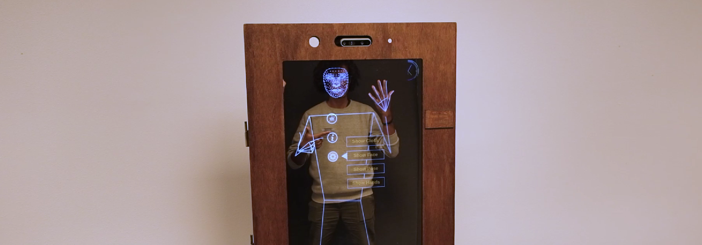

# Second Self



## Description

Second Self is an augmented reality platform based on an augmented mirror: a mirror on which information can be displayed. This project uses an augmented mirror with the Intel D435, a depth and color camera. Using this camera and the pose estimation library mediapipe, a user standing in front of the mirror can interact with it using gestures.<br/><br/>
The goal of this project being to create a platform, we develop a general and multipurpose backend and some specialized modules in the frontend.<br/><br/>
Two versions are currently available, one for cpu and another for gpu if you have a graphic card. The gpu version is slightly faster. to choose between the two versions, edit the DEVICE environment variable in the `second-self/.env` file.

## Requirements

### CPU version

- Nvidia-Docker

### GPU version

- Nvidia-Docker
- A nvidia GPU with drivers installed. Make sure that your version of cuda corresponds to the version used in the Dockerfile

## Launching the demo

The demo starts automatically on startup. If a problem occurs, restart the computer. If the problem persists, see the following sections to find the problem and solve it

## Steps to prepare the demo

### Build the docker image

To build the container from the docker file, simply use `make build`. If you're building the demo version, make sure to add one to the `VERSION=` variable in `second-self/.env` **afterward** so that you won't build for the same version next time.

### Move the `second-self` folder to `/srv/mirror`

### Deploy the services using the Makefile

For the demo to execute on startup, three services must be set up, each corresponding to the three steps required to start the mirror.
## Individual component control
### Manually sending position data from the backend to the frontend

To execute the backend container, use `make run`.<br/>
**GPU version:** Make sure that you have exposed your screen on the local network using `sudo xhost +local:root`.<br/>
Inside the docker container, `python3 main.py` will be executed and launch the backend.
### Serving the frontend

In `sencond-self/frontend`, use:

```bash
python3 -m http.server
```

Make sure to be in a docker container if your computer doesn't have nodeJS.

### Opening the app

Use `make open` to see the result on your machine or `make open_ssh` in a ssh connection in a remote machine.

## Ressources:

- https://github.com/openpifpaf/openpifpaf
- https://google.github.io/mediapipe/solutions/hands.html
- https://google.github.io/mediapipe/solutions/holistic.html
- https://github.com/IntelRealSense/librealsense/
- https://github.com/socketio/socket.io
- https://p5js.org/

## TODOS

- Check keypoint visibillity
- Improve danse module controls
- Different menu type
-
